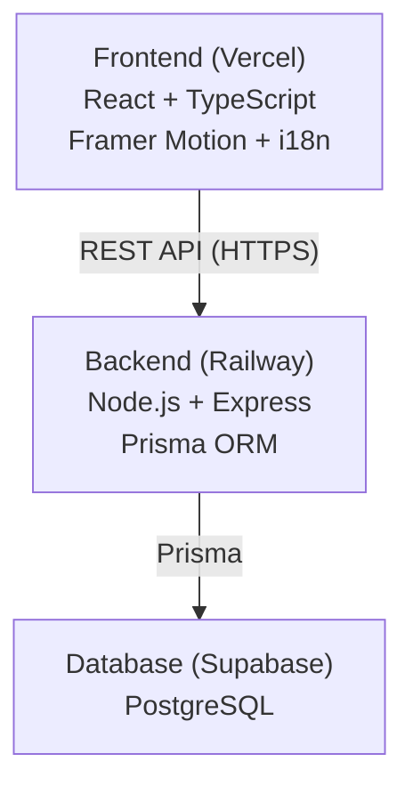

# Sho Hatha? Client


Bilingual (English/Arabic) game-show trivia frontend optimized for one host sharing one screen. The UI is intentionally high-contrast and large-format for room play and video calls.

## Architecture


## Tech Stack
- React 18 + TypeScript (strict)
- Vite + Tailwind CSS
- React Router v6
- React Context + `useReducer`
- Framer Motion
- Axios
- react-i18next (EN/AR + RTL)
- Vitest + React Testing Library

## Local Setup
1. `npm install`
2. Create `.env` from `.env.example`
3. Start backend on `http://localhost:3001`
4. `npm run dev`
5. Open `http://localhost:5173`

## Environment Variables
- `VITE_API_URL`: backend URL (example `http://localhost:3001`)

## Game Flow
1. Setup: enter team names, pick timer.
2. Categories: fetch 6 categories, each team picks 3.
3. Game: 18 alternating turns, timer + aids + feedback.
4. Results: winner or tie, play again reset.

## Key Engineering Decisions
### Reducer Pattern
`useReducer` keeps state transitions explicit and testable. Actions define all allowed game changes, reducing invalid state combinations.

### Timestamp-Based Timer
Timer uses wall-clock timestamps (`startedAtMs`) and computes remaining time from `Date.now()`. This avoids drift from browser timer throttling.

### No localStorage Persistence
State is intentionally ephemeral in v1. Refresh resets game state by design.

## Data Portability
Content lives in backend seed files and is version-controlled:
- `data/categories.seed.json`
- `data/questions.seed.json`

Benefits:
- Content backup in git history
- Easy migration to another PostgreSQL host
- Reviewable content updates via pull requests

## V1 Limitations (Intentional)
- No user accounts
- No persistent match history
- No leaderboards
- No multi-device sync (single host only)
- Game resets on refresh

## V2 Roadmap
### Frontend
- Player phone mode
- Spectator mode
- History/statistics pages
- Sound effects and music
- Custom pack builder UI

### Backend
- Auth + JWT
- Persistent sessions/history
- Leaderboards
- WebSockets for multi-device play
- Admin web dashboard

## Portfolio Screenshots
Capture at 1920x1080:
1. Setup screen
2. Category selection
3. Game screen with timer
4. Feedback overlay
5. Results screen

Also capture Arabic versions to show RTL support.

## Verification
```bash
npm run lint
npm run typecheck
npm test
npm run build
```
